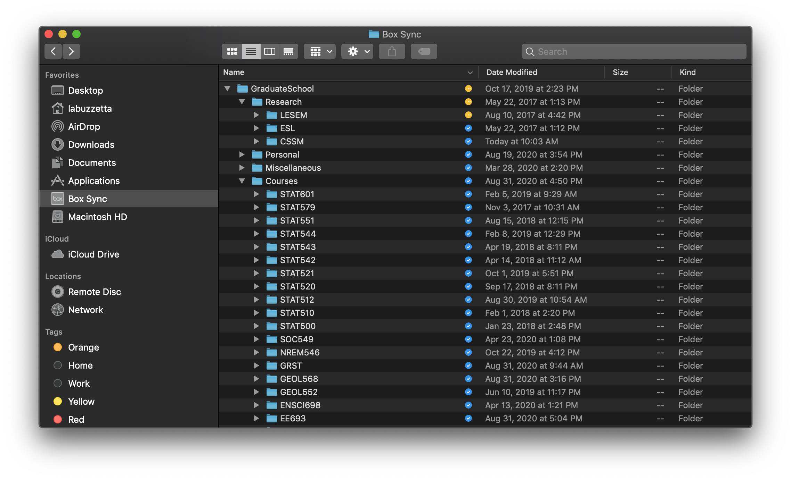
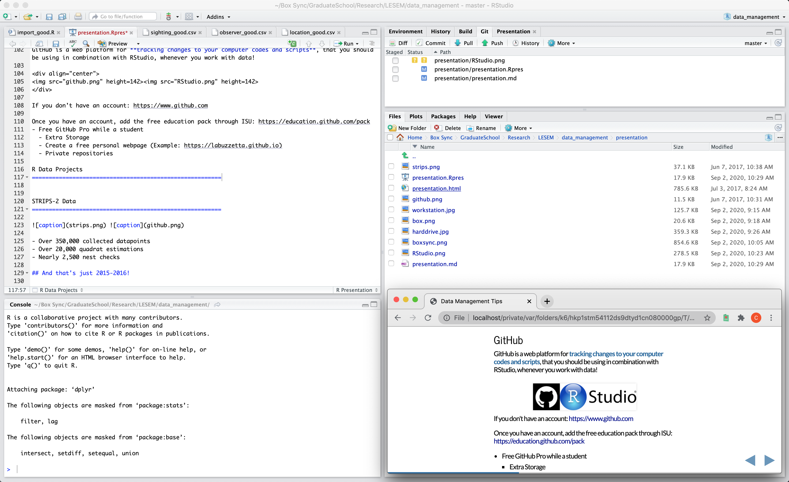
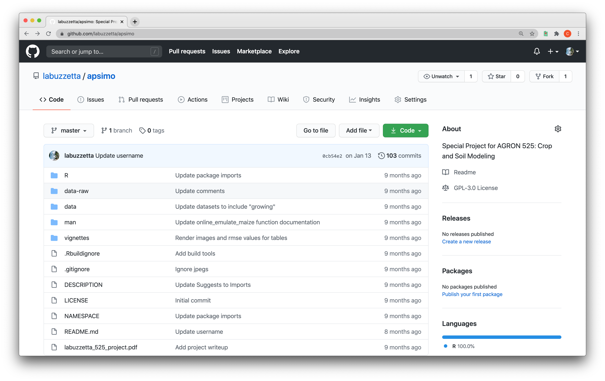

Data Management Tips
========================================================
author: Charlie Labuzzetta
date: September 2, 2020
autosize: true
incremental: false
depends: dplyr, dataManagement, tidyr
width: 1440
height: 900

What is Data Management?
========================================================

The 3 R's of Data Management:

- Redundancy
  - **Backup** your data safely!
  - Use GitHub to **track changes** to files.
- Reliability
  - **Organize** your files for efficient access
  - Never change your **raw data** directly
- Reproducibility
  - **Metadata** helps others learn about your data
  - Communicate edits to raw data via **scripts**
  - Provide **public access** (when applicable)
  
  
Redundancy: Backup
========================================================
incremental: true

For important data / files, you **need** to have a backup of your data (at least one, but preferrably more)!

   

Example:

- Files in (reliably) organized system on **personal computer**
- File system synced automatically to cloud (**BoxSync**)
- File system synced periodically to physical device (**external hard-drive**)
- Scripts and data version control system (**GitHub**)

Reliability: Personal File System
========================================================

Separate file system into major professional events. Further breakdown by courses, research projects, extracurricular programs, personal files.

**phd**
- courses
  - stat_500
  - stat_510
- research
  - bmp
  - conformal
- datafewsion
- personal

BoxSync
========================================================

Iowa State University provides free **unlimited** cloud storage via Box.com

A helpful tool to enable automatic backup of your data to Box.com, is to use BoxSync.
- Store folders / files you want to backup in the BoxSync folder
- As you add / edit files in these folders, changes are automatically backed up to Box.com

Follow the link below for more information on installing BoxSync on Windows or Mac computers:

https://support.box.com/hc/en-us/articles/360043697194-Installing-Box-Sync

BoxSync Example
========================================================

Research Data
========================================================

Within your **backed up** personal file system, you will likely have data related to your research.

After you have a organized file system, you can worry about your research projects:

- Redundancy
  - Use GitHub to **track changes** to files.
- Reliability
  - Never change your **raw data** directly
- Reproducibility
  - **Metadata** helps others learn about your data
  - Communicate edits to raw data via **scripts**
  - Provide **public access** (when applicable)

GitHub
========================================================

GitHub is a web platform for **tracking changes to your computer codes and scripts**, that you should be using in combination with RStudio, whenever you work with data!

If you don't have an account: https://www.github.com

Once you have an account, add the free education pack through ISU: https://education.github.com/pack
- Free GitHub Pro while a student
  - Extra Storage
  - Create a free personal webpage (Example: https://labuzzetta.github.io)
  - Private repositories
  
RStudio: Give up on Excel and learn R!
========================================================

R Data Projects
========================================================

Using GitHub and RStudio, you can create a data project which is:

- Redundant: Backed up and tracked via GitHub

- Reliable: Your raw data is **never altered** directly

- Reproducible: Other scientists can easily understand and access your work

R Data Project Format
========================================================

Project Subdirectories:

- **data-raw**: Put the .csv and other data files from your experiments here **NEVER TOUCH AGAIN**
  - It is so important not to edit your raw data directly, even if the formatting is terrible.
  - We can write R scripts to transform the raw data and clean it up. 
  - The cleaned / transformed data is saved in a new location.
  
- **data**: Cleaned data tables, with nicely formated column names, data types, outliers removed

- **R**: Metadata files which describe the cleaned data tables. Might include data units or collection methods

- **vignettes**: Scripts that generate your analyses / graphics

- **presentation**: Scripts to generate a presenetation with easy access to graphs / tables

Example: STRIPS-2 Data
========================================================

Dr. Lisa Schulte-Moore's STRIPS (Science-based Trials of Rowcrops Integrated with Prairie Strips) Project is one group that has transitioned to using the R Data Package Format.

- Over 350,000 collected datapoints
- Over 20,000 quadrat estimations
- Nearly 2,500 nest checks

## And that's just 2015-2016!

As an example, we will look into the challenges of storing and analyzing (fake) data similar to those collected by the STRIPS project and examine how the R Data Package format would be useful.

Data storage and analysis
========================================================

When we take a look back our raw data, there may be many inconsistencies that we'd like to change:

- Naming Standards
  - Filenames
  - Column names
- Data Types
  - Dates
  - Booleans vs. Yes/No
- Database Design
  - Should I store everything in one table?
  - Will my database design make it easy to analyze my data?

Naming Standards - Poor Example
========================================================

In the column names, look for:
  - Inconsistency
  - Spaces / Weird Characters

|Observer |Location          |SPECIES |Date       |Time                | distance(m)|How recognized? | making sound|
|:--------|:-----------------|:-------|:----------|:-------------------|-----------:|:---------------|------------:|
|JD       |Riverside         |AMRO    |2016-05-11 |1899-01-01 19:01:00 |          45|Visual          |            0|
|JD       |Riverside Park    |EABL    |05/11/2016 |1899-01-01 19:53:00 |          90|visual          |            0|
|mj       |Backyard          |DOWO    |2016-05-16 |1899-01-01 16:27:00 |          24|Visual          |            1|
|Jd       |Backyard          |AMGO    |05-17-2016 |1899-01-01 06:55:00 |          53|Visual          |            0|
|Mj       |backyard          |CLSW    |2016-06-03 |1899-01-01 21:43:00 |          31|visual          |            0|
|Mj       |backyard          |GHOW    |06-03-2016 |1899-01-01 22:24:00 |          20|auditory        |            1|
|jd       |Park              |EABL    |06/06/2016 |1899-01-01 18:28:00 |          34|visual          |            0|
|MJ       |in Riverside park |AMRO    |2016-06-17 |1899-01-01 14:43:00 |          20|heard it        |            1|
|MJ       |Riverside         |GBHE    |2016-06-17 |1899-01-01 15:07:00 |          60|visual          |            0|
|mj       |RP                |PUFI    |06/17/2016 |15:45:00            |          40|visual          |            0|
|mj       |RP                |EABL    |2016-06-17 |16:00:00            |          34|visual          |            0|
|Jd       |yard              |AMGO    |2016-06-18 |07:42:00            |          23|visual          |            0|

Naming Standards - Better?
========================================================

In the column names, look for:
  - full words
  - lower case with underscores
  

| sighting_id| observer_id| location_id|species_id |date                |visual_recognition |audio_recognition |
|-----------:|-----------:|-----------:|:----------|:-------------------|:------------------|:-----------------|
|           1|         492|           1|AMRO       |2016-05-11 19:01:00 |yes                |no                |
|           2|         492|           1|EABL       |2016-05-11 19:53:00 |yes                |no                |
|           3|         213|           2|DOWO       |2016-05-16 16:27:00 |yes                |yes               |
|           4|         492|           3|AMGO       |2016-05-17 06:55:00 |yes                |no                |
|           5|         213|           2|CLSW       |2016-06-03 21:43:00 |yes                |no                |
|           6|         213|           2|GHOW       |2016-06-03 22:24:00 |no                 |yes               |
|           7|         492|           1|EABL       |2016-06-06 18:28:00 |yes                |no                |
|           8|         213|           1|AMRO       |2016-06-17 14:43:00 |yes                |yes               |
|           9|         213|           1|GBHE       |2016-06-17 15:07:00 |yes                |no                |
|          10|         213|           1|PUFI       |2016-06-17 15:45:00 |yes                |no                |
|          11|         213|           1|EABL       |2016-06-17 16:00:00 |yes                |no                |
|          12|         492|           3|AMGO       |2016-06-18 07:42:00 |yes                |no                |

Discussion - Naming Standards
========================================================

There are many ways to name files / columns with consistency:
  - lowercase_underscore
  - camelCaseNoSpaces
  - CapitalizeEveryWord
  - PLEASE_DONT_DO_THIS
  
**Suggestion:** lowercase_underscore

Important People in the "R" World suggest: http://r-pkgs.had.co.nz/style.html

Data Types - Dates
========================================================

There are so many ways to store dates:
  - 2000-07-04 14:00:00
  - 2000-07-04 2:00 PM
  - 2000/07/04 02:00:00 PM
  - 04/07/2000

|Observer |Location          |SPECIES |Date       |Time                | distance-meters|How recognized? | making sound|
|:--------|:-----------------|:-------|:----------|:-------------------|---------------:|:---------------|------------:|
|JD       |Riverside         |AMRO    |2016-05-11 |1899-01-01 19:01:00 |              45|Visual          |            0|
|JD       |Riverside Park    |EABL    |05/11/2016 |1899-01-01 19:53:00 |              90|visual          |            0|
|mj       |Backyard          |DOWO    |2016-05-16 |1899-01-01 16:27:00 |              24|Visual          |            1|
|Jd       |Backyard          |AMGO    |05-17-2016 |1899-01-01 06:55:00 |              53|Visual          |            0|
|Mj       |backyard          |CLSW    |2016-06-03 |1899-01-01 21:43:00 |              31|visual          |            0|
|Mj       |backyard          |GHOW    |06-03-2016 |1899-01-01 22:24:00 |              20|auditory        |            1|
|jd       |Park              |EABL    |06/06/2016 |1899-01-01 18:28:00 |              34|visual          |            0|
|MJ       |in Riverside park |AMRO    |2016-06-17 |1899-01-01 14:43:00 |              20|heard it        |            1|
|MJ       |Riverside         |GBHE    |2016-06-17 |1899-01-01 15:07:00 |              60|visual          |            0|
|mj       |RP                |PUFI    |06/17/2016 |15:45:00            |              40|visual          |            0|
|mj       |RP                |EABL    |2016-06-17 |16:00:00            |              34|visual          |            0|
|Jd       |yard              |AMGO    |2016-06-18 |07:42:00            |              23|visual          |            0|
  
Data Types - Dates
========================================================

**Suggestion:** When possible, YYYY-mm-dd or YYYY/mm/dd or YYYYmmdd, and hh:mm:ss or hhmmss
  - Stores in chronological order
  - Bypasses AM/PM Errors
  - Reduces Month/Day confusion
  - May be combined into a single column when analyzing raw data
  
Main objective: Choose *one* preferred format
  
**Suggestion:** If using R, look into the *lubridate* package

| sighting_id| observer_id| location_id|species_id |date          |time        |visual_recognition |audio_recognition |
|-----------:|-----------:|-----------:|:----------|:-------------|:-----------|:------------------|:-----------------|
|           1|         492|           1|AMRO       |2016-05-11    |19:01:00    |yes                |no                |
|           2|         492|           1|EABL       |2016-05-11    |19:53:00    |yes                |no                |
|           3|         213|           2|DOWO       |2016-05-16    |16:27:00    |yes                |yes               |
|           4|         492|           3|AMGO       |2016-05-17    |06:55:00    |yes                |no                |
|           5|         213|           2|CLSW       |2016-06-03    |21:43:00    |yes                |no                |
|           6|         213|           2|GHOW       |2016-06-03    |22:24:00    |no                 |yes               |
|           7|         492|           1|EABL       |2016-06-06    |18:28:00    |yes                |no                |
|           8|         213|           1|AMRO       |2016-06-17    |14:43:00    |yes                |yes               |
|           9|         213|           1|GBHE       |2016-06-17    |15:07:00    |yes                |no                |
|          10|         213|           1|PUFI       |2016-06-17    |15:45:00    |yes                |no                |
|          11|         213|           1|EABL       |2016-06-17    |16:00:00    |yes                |no                |
|          12|         492|           3|AMGO       |2016-06-18    |07:42:00    |yes                |no                |

Data Types - Units
========================================================

How/where should measurement units be stored?
  - In raw data, note the unit as full words in the column name after a dash
  - But we will want to remove these units from the polished data
  - Put the units in documentation / metadata files
  - Consider changing booleans to "Yes"/"No"
  - Use appropriate data types (integers vs decimals) and check your abbreviations

What's wrong with the table below?

|Observer |Location          |SPECIES |Date       |Time                | distance-meters|How recognized? | making sound|
|:--------|:-----------------|:-------|:----------|:-------------------|---------------:|:---------------|------------:|
|JD       |Riverside         |AMRO    |2016-05-11 |1899-01-01 19:01:00 |              45|Visual          |            0|
|JD       |Riverside Park    |EABL    |05/11/2016 |1899-01-01 19:53:00 |              90|visual          |            0|
|mj       |Backyard          |DOWO    |2016-05-16 |1899-01-01 16:27:00 |              24|Visual          |            1|
|Jd       |Backyard          |AMGO    |05-17-2016 |1899-01-01 06:55:00 |              53|Visual          |            0|
|Mj       |backyard          |CLSW    |2016-06-03 |1899-01-01 21:43:00 |              31|visual          |            0|
|Mj       |backyard          |GHOW    |06-03-2016 |1899-01-01 22:24:00 |              20|auditory        |            1|
|jd       |Park              |EABL    |06/06/2016 |1899-01-01 18:28:00 |              34|visual          |            0|
|MJ       |in Riverside park |AMRO    |2016-06-17 |1899-01-01 14:43:00 |              20|heard it        |            1|
|MJ       |Riverside         |GBHE    |2016-06-17 |1899-01-01 15:07:00 |              60|visual          |            0|
|mj       |RP                |PUFI    |06/17/2016 |15:45:00            |              40|visual          |            0|
|mj       |RP                |EABL    |2016-06-17 |16:00:00            |              34|visual          |            0|
|Jd       |yard              |AMGO    |2016-06-18 |07:42:00            |              23|visual          |            0|

R Data Package Review
========================================================

Again, when making an R Data Package, look at: https://github.com/jarad/RDataPackageTemplate
  - Store raw data in /data-raw
  - Clean raw data with R scripts
  - Import clean data to R package
  - Easily manipulate and analyze clean data
  
  
Database Design - Making data easier to analyze
========================================================
 
How to think about database design:

- A database holds info about objects, events, observations
- A **Relational Database** uses ID's to link entries together

*A Simple Example:*

Single Table Format:

| type  | color | store_1_price | store_2_price |
|-------|-------|---------------|---------------|
| apple | red   | 0.29          | 0.27          |

Database Design - Making data easier to analyze
========================================================
 
Instead we could use a relational database format:

**Fruits**

| fruit_id | type  | color |
|----|-------|-------|
| 29 | apple | red   |

**Stores**

| fruit_id | price | store_id |
|----|-------|----------|
| 29 | 0.29  | 1        |
| 29 | 0.27  | 2        |

Database Design - A More Complex Example
========================================================

Consider the following scenario:
- An organization wants to have a bird watching competition
- Competitors will register with:
  - Name, Birthday, Email
- Competitors will record where, when and which birds they see
  - List of locations (Name, Address, GPS Coordinates)
  - List of observations (Who, When, Where, Which Species, Observation details)
  - List of all species observed (Common Name, Species, Genus)
  
How could this data be managed?

Example - Not the best management
========================================================

|Observer |Location          |SPECIES_1 |Date_1     |Time_1              |SPECIES_2 |Date_2     |Time_2              |
|:--------|:-----------------|:---------|:----------|:-------------------|:---------|:----------|:-------------------|
|JD       |Riverside         |AMRO      |2016-05-11 |01/01/1899 19:01:00 |EABL      |2016-05-11 |01/01/1899 19:53:00 |
|Jd       |Backyard          |AMGO      |2016-05-17 |01/01/1899 06:55:00 |AMGO      |2016-06-18 |01/01/1899 07:42:00 |
|mj       |Backyard          |DOWO      |2016-05-16 |01/01/1899 16:27:00 |CLSW      |2016-06-03 |01/01/1899 21:43:00 |
|MJ       |in Riverside park |AMRO      |2016-06-17 |01/01/1899 14:43:00 |GBHE      |2016-06-17 |01/01/1899 15:07:00 |

Avoid using repetitive groups of columns

See dataManagement::sightings_really_bad for the full table.

Example - Better Managements
========================================================

| observer_id|first_name |last_name |birth_date |email               |
|-----------:|:----------|:---------|:----------|:-------------------|
|         492|John       |Doe       |1987-09-03 |john.doe@gmail.com  |
|         213|Mary       |Jane      |1959-02-27 |mary.jane@gmail.com |

| location_id|location_name  |street_address   |city        |state |country |
|-----------:|:--------------|:----------------|:-----------|:-----|:-------|
|           1|Riverside Park |100 State St     |La Crosse   |WI    |USA     |
|           3|Backyard       |418 Red Apple Dr |La Crescent |MN    |USA     |

| sighting_id| observer_id| location_id|species_id |date                |
|-----------:|-----------:|-----------:|:----------|:-------------------|
|          11|         213|           1|EABL       |2016-06-17 16:00:00 |
|          12|         492|           3|AMGO       |2016-06-18 07:42:00 |

|species_id |genus  |species |common_name        |
|:----------|:------|:-------|:------------------|
|EABL       |Sialia |sialis  |Eastern Bluebird   |
|AMGO       |Spinus |tristis |American Goldfinch |

Database Design
========================================================

Relational database design helps to:
- Reduce the amount of repeat data
- Helps standardize data tables
- Can reduce errors and NA entries
- Makes it easier to understand the metadata / documentation files

Look further at the following tables and documentation:
- dataManagement::observer
- dataManagement::location
- dataManagement::sighting
- dataManagement::species

To view documentation for a dataset:
- Use ? before the dataset name
- Example: ?dataManagement::sighting

Example R Data Project
========================================================

https://github.com/labuzzetta/apsimo

Review
========================================================

The 3 R's of Data Management:

- Redundancy
  - **Backup** your data safely!
  - Use GitHub to **track changes** to files.
- Reliability
  - **Organize** your files for efficient access
  - Never change your **raw data** directly
- Reproducibility
  - **Metadata** helps others learn about your data
  - Communicate edits to raw data via **scripts**
  - Provide **public access** (when applicable)
  
Action Items
========================================================

   

- Organize your personal file system

- Backup your data and install BoxSync

- Git your GitHub account and Github Education Pack

- Store research data in R Data Packages

- Never touch your raw data again!

- Support reproducible research by sharing your repositories on GitHub

Additional Topics
========================================================

- Introduction to RStudio

- Introduction to GitHub

- Making an R Data Package

- Introduction to Tidyverse

- Using GitHub within RStudio

Accessing this presentation
========================================================

You can find this presentation and the associated data on my GitHub page:

https://github.com/labuzzetta/dataManagement

Instructions for installing the package from GitHub are listed on the webpage.

A link to an online version of the presentation alone is:

https://rpubs.com/clabuzze/datamanagement
